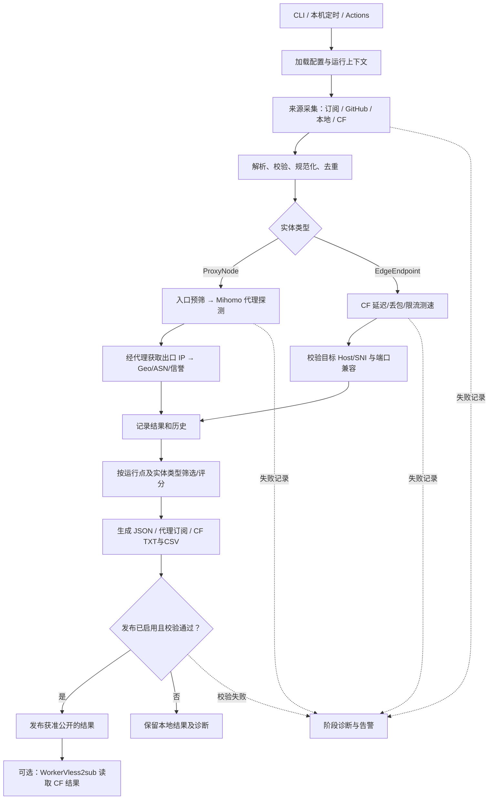

# NodeBench 开发规则

> 版本：1.0（方案基线）｜日期：2026-09-26  
> 目标：从获准使用的公开节点、GitHub 候选文件和 Cloudflare 优选地址收集候选项，在 GitHub Actions 与个人电脑上运行同一套核心程序，输出可追溯的检测结果和可选订阅。本文是开发与验收约定，不表示功能已经实现。

## 0. 总体约束

1. **两种实体**：`ProxyNode` 是带协议及凭据的完整代理配置；`EdgeEndpoint` 是 IP/域名、端口及 Cloudflare 连通信息。两者使用不同检测器、评分和导出器；不能把优选 IP 当成现成代理节点，也不能把代理下载测速 CSV 当作 `ADDCSV` 输入。
2. **同一核心**：CLI、Windows 一键脚本、macOS/Linux 脚本、系统定时任务和 GitHub Actions 都调用 `nodebench run`。运行环境通过 profile 与 `runner_id` 标记，不复制业务逻辑。
3. **模块边界**：模块只通过第 4 节的数据契约传递对象；不互相读取私有数据库表、临时文件或内部类。新增来源、检测器、信誉服务或导出格式应只增加适配器与配置。
4. **有界且获准**：只处理自己拥有、获得授权或明确允许抓取与检测的来源；GitHub 搜索用于发现候选文件，不进行无界公网扫描。每个来源配置许可说明、抓取范围、频率、文件大小和单轮候选上限。测速 URL 也必须由操作者指定或在允许列表内。
5. **结果诚实**：入口 TCP 可达不代表代理可用；CF 边缘测速不代表 EdgeTunnel 最终可用；GitHub Runner 测值不代表用户本地体验；出口 IP 归属和信誉评分不等于安全保证。缺失数据标记为 `unknown`，不伪造零风险。
6. **凭据隔离**：订阅凭据、节点密钥、GitHub/API Token 和完整私有 URI 不进入日志、公开 JSON/CSV、Actions artifact 或公开仓库。原始配置和本机 SQLite 默认仅本地保存；公开导出需显式启用并逐字段脱敏。公开源的再分发也需符合来源许可。

## 1. 实现功能（简要说明）

| 能力 | 预期行为 |
| --- | --- |
| 多源发现 | 读取本地文件、授权订阅及 URL；通过 GitHub 代码搜索发现受控范围内的候选文件；导入明确指定的 CF IP/网段或 CSV。来源可单独开启、暂停和限额。 |
| 解析与去重 | 解析 VLESS、VMess、Trojan、Shadowsocks、Hysteria2、TUIC 与受支持的 Mihomo/Clash YAML；保留不支持项及错误原因。完整连接参数形成稳定指纹，来源分别保留。 |
| 双检测管线 | 代理：入口预筛、Mihomo 真代理请求、延迟和限流下载、通过代理查询出口 IP；CF：候选地址的 TCP/HTTP、丢包与限量下载测速，并验证其与目标域名/端口兼容。 |
| 情报与评分 | 出口 IP 的 GeoIP/ASN/ISP、可选信誉提供商；SQLite 保存各运行点的历史，计算 7/14 日可用率并配置化筛选与排序。CF 使用独立指标，不套用代理纯净度评分。 |
| 结果输出 | 内部结构化 JSON、可导入的代理订阅、CF 优选 TXT 与 `WorkerVless2sub` 专用 CSV、脱敏报告。每份结果标注采样位置、时间、来源与测试口径。 |
| 运行方式 | CLI 分步与全流程、本机脚本、Windows 任务计划程序 / macOS launchd / Linux systemd 用户 timer、Actions 手动及定时运行；GitHub 候选池可供本机二次测速。 |

**交付阶段**：M1 完成配置、来源、本地样例、代理解析/去重、CF 导入与契约；M2 完成两条真实探测、SQLite、JSON/TXT/CSV 及本机一键运行；M3 完成 GitHub 搜索、Actions、系统定时、情报/评分和发布；M4 扩展协议兼容与历史策略。某协议只有在真实连通测试通过后才能标为“支持检测”，否则标为“可解析”。

## 2. 完整流程图



**双运行点协作**：Actions 生成 `global` 候选清单和粗测结果；本机可导入该清单，使用 `local:<设备别名>` 单独测试与排名。历史按运行点隔离，不用 Actions 延迟替换本机延迟。本机关机时不依赖本机任务运行；下次开机可执行补跑。发布仅使用本轮成功且未过期的数据。

## 3. 模块化设计_功能

### 3.1 项目布局与开发规则

```text
nodebench/
├── src/nodebench/
│   ├── core/          # schema、配置、上下文、错误、字段工具、http_utils
│   ├── sources/       # local、subscription、github、cf
│   ├── parsers/       # URI、Base64、YAML、CSV
│   ├── normalize/     # 参数校验、指纹、去重
│   ├── probes/        # proxy/mihomo、cf、测速
│   ├── intelligence/  # exit-ip、geo/asn、reputation、lookup 工厂
│   ├── history/       # SQLite、迁移与统计
│   ├── scoring/       # proxy 与 endpoint 独立策略
│   ├── exporters/     # report、subscriptions、cf-addapi、cf-addcsv
│   ├── publishing/    # 发布前验证与可选上传
│   ├── scheduler/     # 生成/查询/卸载系统计划
│   ├── pipeline/      # 编排（组合根：orchestrator、stages）
│   └── cli/           # 命令与用户可读诊断
├── config/            # default.yaml、sources.yaml、profiles/*.yaml
├── scripts/           # run.bat、run.ps1、run.sh
├── tests/             # 契约、解析、失败路径、导出样例
├── .github/workflows/ # 测试、每日运行
├── input/             # 本地样例（不含真实凭据）
├── output/            # 运行时产物（默认不提交）
└── pyproject.toml
```

- Python 3.12 基线；配置为 YAML，内部数据类型使用带版本号的严格模型。先定义契约与端到端样例，再实现各适配器。依赖锁定版本，外部二进制按平台显式安装或下载并校验哈希；不在执行期悄悄更新到 latest。
- 解析器不执行来源内容；YAML 用安全加载并限制文件大小、嵌套深度及代理数。HTTP 获取设置超时、重试、最大响应字节、允许的重定向和目标域名范围；阻止远端来源将下载器重定向到本机或私有网地址。
- 每个阶段输入、输出和错误码固定；异常不能默默变成“节点不可用”。取消运行应释放 Mihomo 子进程和监听端口。日志以 `run_id`、`source_id`、脱敏 `item_id` 关联。
- 分层依赖：业务包（sources/parsers/normalize/probes/intelligence/history/scoring/exporters/publishing/scheduler）只依赖 core；pipeline 是唯一组合根，cli 调 pipeline/CLI 表面。禁止业务包互相 import（共享工具放 core.fields / core.http_utils）。
- 参考项目只作为设计或适配依据，复制代码前单独核对其许可证及依赖许可证。基础框架自主实现，以免 Fork 上游后受其目录结构束缚。

### 3.2 来源采集 `sources`

**输入**：来源配置、抓取预算、缓存索引。**输出**：`RawItem[]` 与每源 `SourceReport`。

1. `local` 读取指定文件夹的 URI、Base64、YAML 和 CSV；`subscription/url` 只读取显式列出的、已授权的 HTTPS URL，记录 ETag/Last-Modified、获取时间、来源地址与许可标签。没有授权来源时允许以样例离线运行。
2. `github_search` 用 GitHub 认证身份调用代码搜索或 `gh search code` 适配器。配置允许的组织/仓库、文件名/扩展名、关键词、文件大小、每轮文件数和缓存 TTL；先检索文件元数据，再获取有变化的文件。搜索命中是“待审核来源”，只有符合来源策略与再分发规则的候选才进入探测。认证/限流/权限不足时给出诊断，并继续处理其他已启用来源；遵守重试和 `Retry-After`，不得绕开限制抓网页。[GitHub CLI 文档](https://cli.github.com/manual/gh_search_code)说明 CLI 搜索使用旧版代码搜索，结果可能与网页不同，因此两个后端结果不能假设一致。
3. `cf` 导入用户指定的 IP、CIDR 或 CSV；默认只测试已列明的候选或明确允许的网段，并按采样上限抽取。导入第三方 CF CSV 时先映射字段、单位和端口，不能把历史测速值当作本次实测。
4. 缓存分为“文件内容缓存”与“探测结果缓存”，分别设置 TTL；失败不会覆盖上次成功内容，过期内容只能标注 `stale` 用于诊断，不能自动进入新发布。

**参考**：[Free-Nodes](https://github.com/735754647/Free-Nodes) 的公开订阅抓取、格式解析、去重和 Actions 流程；[GitHub CLI `gh search code`](https://cli.github.com/manual/gh_search_code) 的搜索适配接口；[CloudflareSpeedTest](https://github.com/XIU2/CloudflareSpeedTest) 的候选文件和测速输入方式。参考并不意味着默认抓取或再分发这些项目的数据源。

### 3.3 解析、校验与去重 `parsers` / `normalize`

**输入**：`RawItem[]`。**输出**：`ProxyNode[]`、`EdgeEndpoint[]`、`ParseIssue[]`。

- URI 解析严格区分协议字段；Base64、URL 转义、IPv6、插件参数、TLS/SNI、WS/gRPC/HTTP 等传输字段均规范化。不能无损表达的配置标为 `unsupported`，保留脱敏原因，不能猜测缺失的 UUID、密码或 SNI。原始链接中的备注只作展示，不参与指纹。
- `ProxyNode` 指纹基于协议、主机/端口、认证材料的**密钥化摘要**、传输、安全参数和路径等所有影响连接的字段；避免把凭据或可逆摘要写入公开文件。不同来源命中相同指纹时合并来源列表。`EdgeEndpoint` 用地址、端口、TLS/目标域名约束形成单独指纹。
- 不按出口 IP 合并配置不同的代理；出口 IP 分组只用于多样性提示。域名解析变化、同一出口多个入口和不同凭据须保留独立实体。

**参考**：[Free-Nodes](https://github.com/735754647/Free-Nodes) 的格式覆盖与协议参数去重。协议兼容以本项目固定测试样例及实际内核支持为准。

### 3.4 代理探测 `probes/proxy`

**输入**：`ProxyNode[]` 与探测预算。**输出**：`ProxyProbeResult[]`。

1. DNS、TCP 入口预筛仅节省资源，不能作为代理成功证明；对 UDP 型协议采用适配的预筛，不能用 TCP 失败直接淘汰。
2. 以受控 Mihomo 进程加载当前批次配置，建立仅绑定 `127.0.0.1` 的测试端口；逐节点切换或使用独立隔离实例，经该节点请求受控检测 URL。记录 DNS/握手/HTTP 首字节延迟、成功次数、超时和失败阶段。
3. 只对连通项做限量下载，限制总节点数、并发、单节点字节数与总流量；记录 `speed_mbps` 与 `speed_mb_s` 的换算口径，失败与未测试要区分。测速服务不稳定时标记本次 `measurement_error`，不要打成节点失活。
4. 本机环境代理、路由与 Mihomo 出站可能形成回环；启动时检查并记录探测路径。一次运行中的内核版本、配置模板和探测 URL 写入元数据。

**参考**：[Free-Nodes](https://github.com/735754647/Free-Nodes) 的 Mihomo 实际代理检测；[faceair/clash-speedtest](https://github.com/faceair/clash-speedtest) 的受限下载、延迟过滤与测速口径。`clash-speedtest` 可作为可选探测后端，若引入其代码或二进制分发须核对 GPL-3.0 许可证；[FullTClash](https://github.com/AirportR/fulltclash) 仅参考出入口拓扑与检测维度，其原仓库已归档。

### 3.5 CF 端点探测 `probes/cf`

**输入**：`EdgeEndpoint[]`、目标 Host/SNI、允许端口与测速 URL。**输出**：`EndpointProbeResult[]`。

- 可用外部 `CloudflareSpeedTest` 的固定版本作适配后端；将其 CSV 的“IP 地址、已发送、已接收、丢包率、平均延迟、下载速度(MB/s)、地区码”逐列映射到内部模型。工具默认输出未包含 WorkerVless2sub 所需的端口、回源端口及 TLS 字段，必须从配置和实际验证补齐。其测速结果是当前运行点到目标 CDN 的测值。[CloudflareSpeedTest 说明](https://github.com/XIU2/CloudflareSpeedTest/blob/master/README.md)
- 检查 IP:端口的 TCP/HTTP/TLS 与目标 Host/SNI 的响应兼容；如果目标 Worker/Pages 不能通过该路径访问，标记 `incompatible`，不导出。按本机/Actions 分别测速；可配置 IPv4/IPv6、端口和预算，绝不从全网自动枚举开放端口。

### 3.6 出口情报 `intelligence`

**输入**：成功的 `ProxyProbeResult`。**输出**：`ExitObservation` 和 `ReputationObservation`。

- 使用当前代理监听端口查询回显服务，确认响应经所选节点离开；记录出口 IP、查询服务、时间和可信状态。配置中的 server 是入口，不能据此判定出口国家。GeoIP、ASN、ISP 基于出口 IP，服务异常标记 `unknown`。
- 信誉提供商为可选插件，返回提供商名、原始分数、统一风险等级、查询时间和证据字段；不同服务的分数先归一化，再参与评分。检测到代理/机房属性不能自动等同恶意；额度耗尽不以“纯净”替代。按出口 IP 缓存，限制外部请求数。
- 如使用 `xykt/IPQuality` 的 HTTP/SOCKS5 检测能力，须通过 Mihomo 暴露的本地 SOCKS 入口并验证输出 IP 是该代理出口；先验证其当前 CLI/JSON 接口和许可证，再实现独立适配器。

**参考**：[SmartSub](https://github.com/LinVireo/SmartSub) 的 IP-API/AbuseIPDB 风险来源与筛选思路；[xykt/IPQuality](https://github.com/xykt/IPQuality) 的多源风险与 IP 类型维度；[FullTClash](https://github.com/AirportR/fulltclash) 的落地 IP 思路。任何第三方“纯净度”均为提供商判断，不作为真实性承诺。

### 3.7 历史、评分与筛选 `history` / `scoring`

**输入**：本轮观测、对应 `runner_id` 历史与规则版本。**输出**：分类型的 `RankedItem[]`。

- SQLite 含 `sources`、`items`、`source_items`、`runs`、`probe_observations`、`exit_observations`、`reputation_observations`、`schema_migrations`。唯一键包含 `item_id + runner_id + run_id + test_type`；写入事务化、重复运行可幂等，定期按保留期限清理。数据库默认不提交公开仓库；Actions 若要计算跨日稳定性，可从受控持久化 artifact/私有存储恢复历史并验证版本，无法恢复时明确标注历史不足。
- 7/14 日可用率按已安排且实际执行的检测次数计算，缺失日期不当作成功或失败；样本数和观测跨度一并输出。`source_quality` 使用有样本量门槛的历史统计，仅决定来源预算，不跳过当前真探测。
- 代理先按硬条件筛选（真代理成功、国家、最大延迟、最小速度、风险上限），再按可配置权重排序。默认示例 `latency=.25, speed=.25, purity=.25, stability=.15, loss=.10`，有效维度加权重归一；关键项缺失时按配置 `exclude` 或 `pending`，不可当满分。稳定性样本不足时显式降权。CF 端点独立按兼容性、丢包、延迟、下载速度及样本数评分；不把代理出口信誉套到 CF Anycast IP。
- 分数是配置与测量口径的函数；每条结果写入 `scoring_version`、阈值快照、`runner_id`，保证可重算。跨运行点不直接按同一排序表比较。

**参考**：[SmartSub](https://github.com/LinVireo/SmartSub) 的多维过滤/评分；[Free-Nodes](https://github.com/735754647/Free-Nodes) 的性能筛选。历史与运行点分离为本项目设计要求。

### 3.8 导出和发布 `exporters` / `publishing`

**输入**：`RankedItem[]`、发布策略。**输出**：带清单与校验报告的产物。

| 文件 | 内容与用途 | 发布规则 |
| --- | --- | --- |
| `report.json` | schema v1、运行点、时间、统计、脱敏测值、失败原因 | 默认脱敏；不含节点认证材料。 |
| `proxy-clash.yaml` / `proxy-raw.txt` | 完整代理配置供客户端导入 | 默认只本地生成；只有来源允许再分发且用户显式开启时可公开。 |
| `cf-addapi.txt` | 兼容地址列表，一行一个 `IP:PORT#备注`（具体格式以适配器契约测试为准） | 仅含经兼容验证的端点；可配置公开。 |
| `cf-addcsv.csv` | `WorkerVless2sub ADDCSV` 专用九列：`IP地址,端口,回源端口,TLS,数据中心,地区,城市,TCP延迟(ms),速度(MB/s)` | 严格字段顺序、布尔与单位；不明数据留空或拒绝该行，不能臆造。 |
| `manifest.json` | 各文件 SHA-256、生成时间、schema/评分版本、条目数和运行状态 | 发布校验入口。 |

`WorkerVless2sub` 的 `ADDAPI` 读取优选地址 TXT，`ADDCSV` 读取 iptest 风格 CSV，`DLS` 按 CSV 速度字段的**数值**筛选；其[项目说明](https://github.com/cmliu/WorkerVless2sub/blob/main/README.md)与[示例 CSV](https://raw.githubusercontent.com/cmliu/WorkerVless2sub/main/addressescsv.csv)列出实际格式。`ADDCSV` 只接端点结果，不接代理节点 CSV。若使用 EdgeTunnel，端点还需结合用户自己的 Host/UUID/Path/SNI 配置才能生成可用订阅；本项目不把优选地址自动伪装成现成 VLESS 节点。发布前用固定样例跑导入兼容测试。

输出先写临时目录，完成 schema、非空、泄密扫描及兼容验证后原子替换 `output/latest/`。零有效项、关键源全失败、探测未完成或 schema 不匹配时发布失败并保留上一版，报告本轮错误；不能把上一版重写为“今日有效”。GitHub 发布用受限权限与独立发布步骤，避免公开提交私有 DB、缓存及 Token。

### 3.9 运行器与调度 `cli` / `scheduler`

- CLI：`nodebench run --profile local|github|cf-only|proxy-only`；`collect`、`probe`、`inspect`、`score`、`export` 接收显式 `--run-id` 或 `--input`，独立执行时校验上游 schema。`nodebench doctor` 检查 Python、二进制、凭据、配置、可写目录及测速目标。`--dry-run` 只检查来源范围和预算，不对外探测。
- 本机：`scripts/run.bat`/`run.ps1`/`run.sh` 调用同一 CLI，使用项目环境并把日志写到本机目录；首次安装脚本显式安装固定依赖、显示失败原因。Windows 的“任务计划程序”提供“错过后尽快运行”，macOS 用用户 launchd，Linux 用 systemd 用户 timer 的 `Persistent=true`；系统关机或用户会话不满足条件时不会保证准点执行。`scheduler install|status|uninstall` 必须幂等且只操作本项目创建的任务，安装前展示时间、profile 与命令。
- Actions：默认分支上的 `workflow_dispatch` 和 `schedule`，示例 `cron: "37 3 * * *"`、`timezone: "Asia/Shanghai"`；使用同一 CLI、锁定依赖、最小权限、并发互斥和预算。工作流先上传诊断/候选，再在验证通过且已启用发布时更新结果；不把 token 或私有订阅作为 artifact。定时运行可能延迟或丢弃，连续无活动的公开仓库可能被停用，应提供 `status` 检查和手动运行入口。[GitHub 工作流语法](https://docs.github.com/en/actions/reference/workflows-and-actions/workflow-syntax)、[计划事件说明](https://docs.github.com/en/actions/reference/workflows-and-actions/events-that-trigger-workflows)。

## 4. 模块化设计_通信

### 4.1 统一数据契约

模块内可使用 Python 对象；跨模块边界交换下列可序列化 DTO。磁盘文件采用 UTF-8 JSON/JSONL，字段名为 snake_case，UTC 时间用 ISO 8601 `Z`，所有测速值带显式单位；版本号 `schema_version: 1`。任何新增必需字段需升 schema 版本并写迁移器。示意：

```json
{
  "schema_version": 1,
  "run_id": "20260926T033700Z-abc123",
  "runner_id": "local:desktop-a",
  "item_id": "hmac-sha256:...",
  "kind": "proxy_node",
  "source_ids": ["local-1", "github-approved-1"],
  "observed_at": "2026-09-26T03:37:00Z",
  "status": "ok",
  "measurements": {"latency_ms": 125.0, "speed_mb_s": 6.2},
  "exit": {"ip": "203.0.113.7", "country_code": "JP", "asn": null},
  "errors": []
}
```

示例 IP 是文档保留地址，不代表真实节点。`kind` 还可为 `edge_endpoint`，对应 `exit` 必须为空、`endpoint` 记录地址/端口/目标 Host 与兼容性。`RawItem` 带 `source_id`、`content_type`、`fetched_at`、来源许可标签和受控原文引用；解析后原文与认证材料留在私有存储，公开 DTO 只带不透明 `item_id`。`status` 固定为 `ok | failed | skipped | unsupported | unknown | stale`；`errors` 使用 `{stage, code, message_redacted, retryable}`。未测试值是 `null`，不能写 `0`。

### 4.2 相邻模块通信表

| 发送 → 接收 | 载荷 | 发送方保证 / 接收方校验 |
| --- | --- | --- |
| 运行器 → 来源 | `RunContext`（run_id、runner_id、profile、budget、deadline） | 配置合并顺序为 default → profile → 环境变量中的密钥 → CLI；禁止把密钥序列化到结果。 |
| 来源 → 解析 | `RawItem[] + SourceReport` | 原文大小受限、来源可追溯；解析器按类型拒绝危险或未知格式。 |
| 解析 → 规范化 | `ParsedProxy | ParsedEndpoint | ParseIssue` | 每项只有一种实体类型；规范化检查必需字段和指纹版本。 |
| 规范化 → 探测 | `ProxyNode[]` 或 `EdgeEndpoint[]` | 只传验证通过的模型；探测器按 kind 调度，返回与 `item_id` 一一对应的结果。 |
| 探测 → 情报 | `ProxyProbeResult(status=ok)` | 情报服务必须经当前代理获取出口；CF 端点不进入此接口。 |
| 探测/情报 → 历史 | `ObservationBatch` | 事务写入、幂等键、记录方法/时间/运行点及缺失原因。 |
| 历史 → 评分 | `CurrentObservation + HistorySummary` | 查询仅返回同一 runner_id 的历史；评分模块记录规则版本和样本数。 |
| 评分 → 导出 | `RankedProxy[]` / `RankedEndpoint[]` | 导出器拒绝错误 kind、过期或未通过硬筛的条目。 |
| 导出 → 发布 | `ArtifactManifest + ValidationReport` | 只有 `publishable=true` 且有来源再分发许可时更新公开目录；失败保留旧版本。 |

### 4.3 事件、失败与兼容规则

1. 编排器以阶段 `collect → parse → normalize → probe → inspect → persist → score → export → publish` 串行推进；同阶段内部允许有界并发。各阶段完成后产出计数与错误摘要，以 `run_id` 关联，禁止靠扫描上一个阶段的目录猜测输入。
2. 某个来源失败只影响该来源；单个节点失败只影响该项。缺少 Mihomo 时代理探测为阶段失败，但 CF 分支可继续；缺少信誉 API 时相应维度为 `unknown`。数据库事务失败或导出校验失败阻断发布。
3. 退出码：`0` 全部请求阶段完成且输出有效；`2` 配置/依赖错误；`3` 来源全部失败；`4` 探测或存储关键失败；`5` 导出/发布校验失败。可选源或可选信誉服务失败时允许 `0`，但 `manifest` 中必须为 `partial` 并可由 `--strict` 升为非零。
4. 模块契约变更要更新 schema 样例、迁移、契约测试与使用文档；外部工具适配器单独记录版本与解析映射，不让第三方 CSV 字段直接贯穿内部各模块。

### 4.4 配置样例（非可直接部署的凭据）

```yaml
profile: local
runner_id: local:desktop-a
sources:
  local: {enabled: true, paths: ["input/"]}
  subscriptions: {enabled: false, urls: []}
  github:
    enabled: false
    allowed_repositories: []
    queries: ['"vless://" filename:sub.txt']
    max_files_per_run: 30
    cache_ttl_hours: 24
  cf: {enabled: false, candidate_files: [], max_ips_per_run: 200}
probe:
  proxy: {enabled: true, concurrency: 10, max_nodes: 100, max_download_mb_each: 5}
  cf: {enabled: true, concurrency: 20, max_download_nodes: 20, target_host: ""}
intelligence: {reputation_enabled: false}
history: {days: 14}
publish: {enabled: false, allow_proxy_credentials: false}
```

`publish.allow_proxy_credentials` 即使设为 `true`，仍要求每个来源允许再分发且进行预发布审查；配置中只写环境变量名，不写密钥本身。实际运行前用户需提供目标 Host/SNI、明确的候选源与测速目标；空值应产生可读的配置错误，不应自动猜测。

## 5. 用户验收以及使用

### 5.1 交付物与验收标准

| 编号 | 操作 | 通过标准 |
| --- | --- | --- |
| A1 安装与诊断 | 新环境运行安装说明及 `nodebench doctor` | 三个平台支持的依赖可识别；缺少 Mihomo/配置/Token 时提示具体项、修复路径和非零退出码，无堆栈泄密。 |
| A2 多源采集 | 使用本地固定样例，并分别启用一个获准订阅、一个受限 GitHub 搜索、一个 CF 候选文件 | 每条候选记录 `source_id` 和许可标签；限额生效；某一源失败不影响其他源，日志不泄露完整 URI。 |
| A3 解析与去重 | 输入同一节点不同备注、不同传输参数及同一 IP 的 CF 端点 | 相同连接参数合并且保留多个来源；不同传输保留两项；CF 独立计数；不支持项给出原因。 |
| A4 真探测 | 对可用/不可用代理与 CF 目标运行 `nodebench run --profile local` | 入口 TCP 成功但代理失败不得判为可用；CF 未通过 Host/SNI 兼容验证不得导出；测值带单位、时间和 `runner_id`。 |
| A5 情报与历史 | 同一运行点连续执行多轮，模拟一次超时及一次信誉服务故障 | 出口 IP 从代理回显获得；历史可查询，样本数正确；信誉故障标 `unknown`，不清空有效历史。 |
| A6 输出兼容 | 检查 `report.json`、代理订阅、`cf-addapi.txt`、`cf-addcsv.csv` | JSON schema 可解析；专用 CSV 九列与端口/TLS/MB/s 单位匹配；代理 URI 不混入 CF 输出；WorkerVless2sub 样例导入测试通过。 |
| A7 一键与定时 | 运行本机脚本、安装/查看/卸载系统任务，再触发一次 Actions 手动运行 | 调用相同 CLI；系统任务只创建本项目项且可撤销；Actions 与本机分别标记运行点，输出不互相覆盖。 |
| A8 发布与失败 | 故意提供空源、错误 CSV、过期缓存和无效凭据 | 本轮有明确非零状态/诊断，公开结果不被空文件覆盖；Token、密码、私有原文不出现在日志与公开文件中。 |
| A9 回归 | 执行解析、契约、评分、导出、迁移与端到端固定样例测试 | 所有必需测试通过；真实外网测试可单独运行，CI 不依赖不稳定的公开免费节点才能绿灯。 |

### 5.2 用户使用路径

1. 下载项目并运行 `nodebench doctor`；用样例执行 `nodebench run --profile local --dry-run`，确认来源范围、测速 URL、总流量预算和输出路径。
2. 将自己获准使用的订阅/本地文件加入 `sources.yaml`；需要 GitHub 搜索时明确限定仓库及候选文件并配置 Token；需要 CF 时提供候选 IP、目标 Host/SNI 和允许端口。配置文件不写密码或 API 密钥，使用环境变量。
3. Windows 双击 `scripts/run.bat` 或运行 `scripts/run.ps1`；macOS/Linux 运行 `./scripts/run.sh`；高级用户运行 `nodebench run --profile local`。查看 `output/latest/manifest.json` 和脱敏 `report.json`，按需本地导入代理订阅。
4. 需要本机每日运行时，执行 `nodebench scheduler install --profile local --time 04:37`，再用 `nodebench scheduler status` 检查；系统时区取本机设置。电脑关机不保证运行，开启系统的“错过后补跑”策略。卸载用 `nodebench scheduler uninstall`。
5. 需要 Actions 时，设置最小权限的凭据与固定来源，手动 `workflow_dispatch` 验证一次后启用每日计划。仅在公开来源许可、脱敏检查和目标 WorkerVless2sub 导入测试通过后开启发布，把 `cf-addapi.txt` 的公开 URL 填入 `ADDAPI`，或把 `cf-addcsv.csv` 的 URL 填入 `ADDCSV` 并按 MB/s 数值设置 `DLS`；用户自己的 EdgeTunnel/WorkerVless2sub Host、UUID、Path、SNI 另行配置。

### 5.3 完成定义

所有 A1–A9 验收通过，三种运行方式使用相同配置模型，代理与 CF 两条路径各至少有一个真实成功样本及一个失败样本；输出格式与外部消费者的固定测试样例通过；授权来源和隐私检查通过。之后才称为 v1.0。评分阈值、并发和每日时间均为可配置初值，须用用户实际网络的测试数据调整。

## 6. 参考资料与使用边界

- [735754647/Free-Nodes](https://github.com/735754647/Free-Nodes)：采集、解析、Mihomo 检测和 Actions 的参考实现。
- [LinVireo/SmartSub](https://github.com/LinVireo/SmartSub)：IP 风险来源、过滤与评分思路。
- [faceair/clash-speedtest](https://github.com/faceair/clash-speedtest)：代理延迟和限量下载测速参考；引入代码前核对 GPL-3.0。
- [XIU2/CloudflareSpeedTest](https://github.com/XIU2/CloudflareSpeedTest)：CF 候选测试及 CSV 字段来源。
- [xykt/IPQuality](https://github.com/xykt/IPQuality)：可选多源 IP 情报适配思路；CLI/JSON/代理模式须以集成时版本验证。
- [AirportR/FullTClash](https://github.com/AirportR/fulltclash)：落地 IP/拓扑思路；原仓库归档，仅作参考。
- [cmliu/edgetunnel](https://github.com/cmliu/edgetunnel) 与 [cmliu/WorkerVless2sub](https://github.com/cmliu/WorkerVless2sub)：最终订阅场景与优选地址接口，具体字段以当前目标版本的固定契约测试为准。
- [GitHub Actions 计划事件](https://docs.github.com/en/actions/reference/workflows-and-actions/events-that-trigger-workflows) 与 [工作流语法](https://docs.github.com/en/actions/reference/workflows-and-actions/workflow-syntax)：时区、延迟和定时任务行为。

> 注意：上述项目是设计参照，不是未经审查即可直接合并的依赖。实现时固定版本、核对许可证、上游接口和数据来源授权；优先通过适配器接入。

## 7. agent 开发要求

> 适用对象：负责本项目实现、重构与修复的 AI agent。以下三条为强制工作流，与个人习惯冲突时以本节为准；与第 0 节总体约束冲突时以第 0 节为准。

1. **每次修改即提交**：每完成一个语义完整的改动（一个功能点、一次修复、一次文档更新）就立即执行 `git add` + `git commit` 保存，不跨多个改动批量提交，不在工作区有未提交改动时开始下一项无关工作。提交信息用祈使句、格式 `<类型>: <改动范围>`，类型取 `feat | fix | refactor | docs | test | chore`；提交前逐文件核对暂存区，禁止带入凭据、完整私有 URI、Token、SQLite 数据库与 `output/` 产物。
2. **同步更新记录**：每次提交同时维护项目根目录的 `更新记录.md`，一条修改一行，严格使用 `时间-修改内容` 格式；时间用本机本地时间 `YYYY-MM-DD HH:MM`，修改内容一句话说明改了什么及原因（例：`2026-09-26 14:03-新增 agent 开发要求章节`）。该文件与代码在同一提交中更新；一次改动涉及多个模块时合并为一行，用分号并列，不拆成多条也不追加重复记录。
3. **参考代码统一隔离**：需要 clone 外部仓库查看源码或复制参考实现时，一律克隆到项目根目录新增的 `参考/` 文件夹下（`git clone <url> 参考/<仓库名>`）；禁止散落在根目录其它位置、`src/`、`tests/` 或系统临时目录。`参考/` 必须写入 `.gitignore`（`参考/`），任何情况下都不得 `git add -f` 强制纳入版本库；复制代码前核对来源许可证，并在提交信息注明来源仓库。

**前置检查**：开始任务先 `git status` 确认工作区干净；仓库尚未初始化时先 `git init` 并建立 `.gitignore`（至少包含 `参考/`、`output/`、`*.db`、`.venv/`、`__pycache__/`）。每次提交后用 `git log --oneline -3` 自查提交是否落盘、`更新记录.md` 是否同步。
